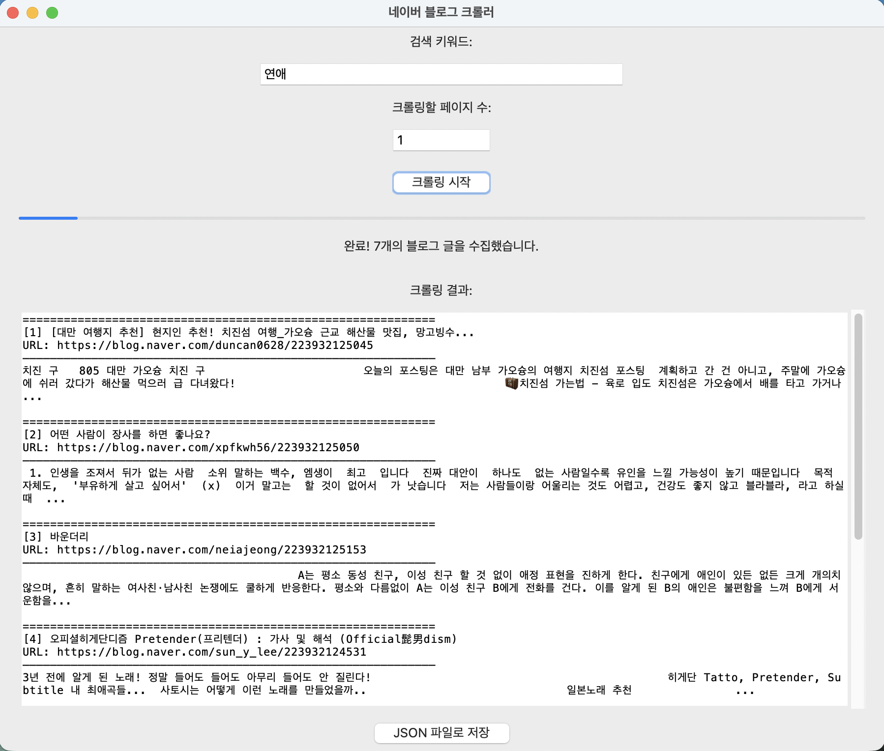

# 🕷️ 네이버 블로그 크롤러

키워드를 기준으로 네이버 블로그 검색 결과를 크롤링하여 **제목, URL, 본문 내용**을 수집하고 JSON 파일로 저장하는 Python 기반의 크롤러입니다.  
Selenium과 BeautifulSoup을 활용하여 동적 페이지도 안정적으로 처리할 수 있습니다.

---

## 📦 주요 기능

- 키워드 기반 블로그 검색
- 블로그 제목, 링크, 본문 추출
- 여러 페이지에 걸친 크롤링 지원
- JSON 파일로 저장
- iframe 구조의 블로그 본문까지 처리 가능



---

## ⚙️ 설치 방법

### 1. 프로젝트 클론

```bash
git clone https://github.com/yourusername/naver-blog-crawler.git
cd naver-blog-crawler
```

### 2. 필요 패키지 설치

Python 3.7 이상이 설치되어 있어야 합니다. 다음 명령어로 필요한 라이브러리를 설치하세요:

```bash
pip install -r requirements.txt
```

> `requirements.txt` 파일이 없다면 아래 명령어로 설치할 수 있습니다:

```bash
pip install selenium beautifulsoup4
```

### 3. ChromeDriver 설치

- [Chrome 브라우저](https://www.google.com/chrome/)가 설치되어 있어야 합니다.
- Chrome 버전에 맞는 [ChromeDriver](https://chromedriver.chromium.org/downloads)를 다운로드합니다.
- 시스템 `PATH`에 등록하거나 프로젝트 폴더에 위치시킵니다.

---

## 🚀 실행 방법

### GUI 버전 (권장)

```bash
python gui_crawler.py
```

- 직관적인 그래픽 인터페이스
- 실시간 진행 상황 표시
- 결과 미리보기 기능
- 파일 저장 위치 선택 가능

### 커맨드라인 버전

```bash
python main.py
```

실행 시 아래와 같은 입력을 요청받습니다:

```
검색할 키워드를 입력하세요 (예: 연애): 연애
크롤링할 페이지 수를 입력하세요 (예: 3): 3
```

결과는 `naver_blog_연애.json` 형식의 JSON 파일로 저장됩니다.

---

## 📝 출력 형식

생성된 JSON 파일은 다음과 같은 구조를 가집니다:

```json
[
  {
    "title": "블로그 제목",
    "url": "https://blog.naver.com/example",
    "content": "본문 내용입니다..."
  },
  ...
]
```

---

## 🛠️ 참고 사항

- 크롬 브라우저는 **Headless 모드**로 실행되므로 화면을 띄우지 않고 동작합니다.
- 블로그 본문이 iframe 내부에 있는 경우도 자동 처리됩니다.
- `time.sleep()`을 통해 서버 요청 간의 간격을 조절하여 안정성 확보

---

## 📄 라이선스

이 프로젝트는 MIT 라이선스를 따르며, **개인 및 상업적 사용이 자유롭습니다.**
